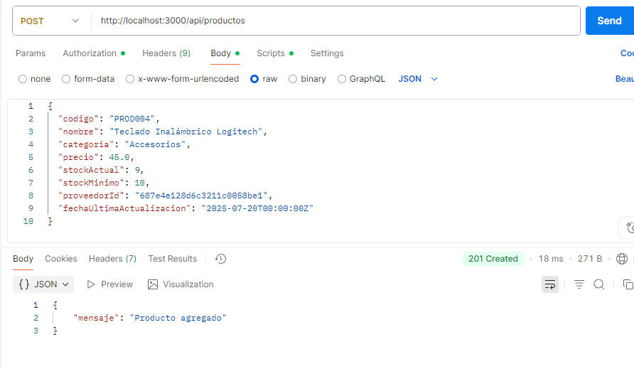
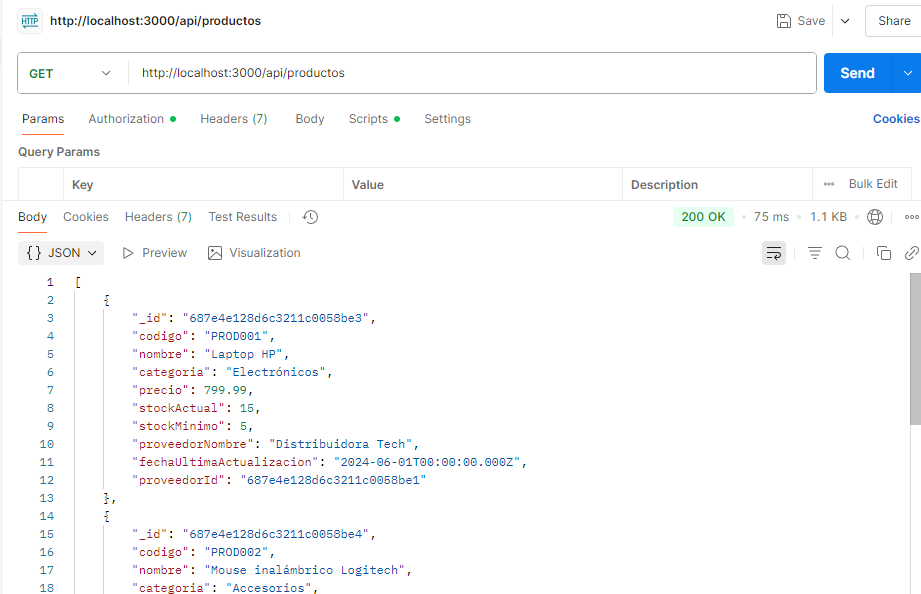
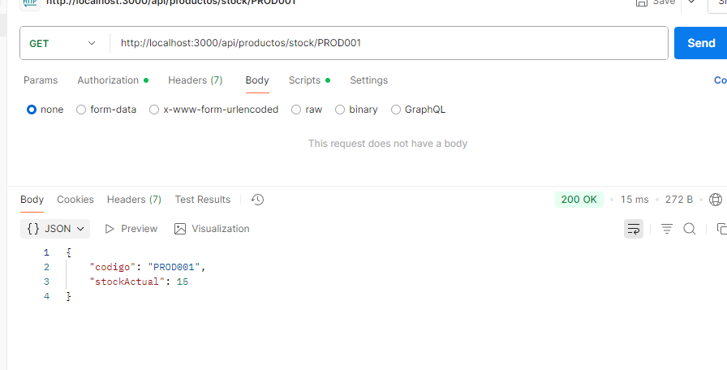
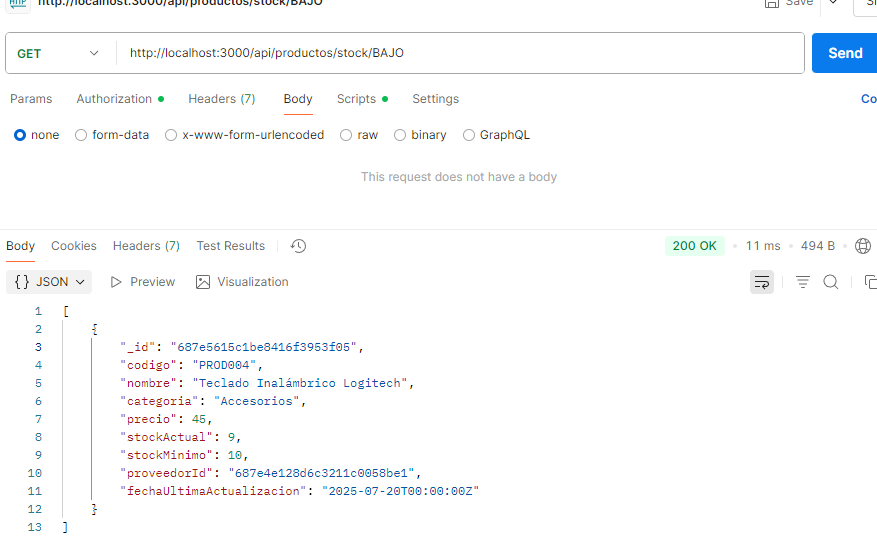
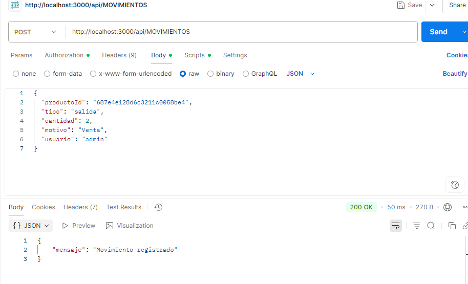
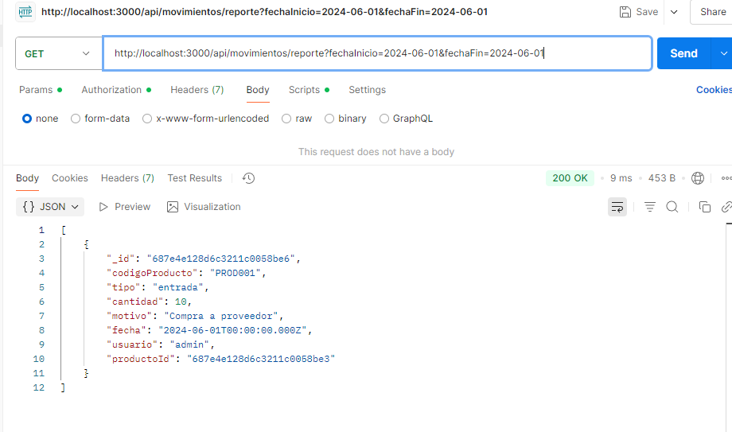

# PROYECTO FINAL - BASE DE DATOS II 

### GRUPO 6 - Integrantes:

- Juarez Acherielli Franco  
- Castellaro Santiago  
- Canclini Lucía  
- Alvarez Balboa Rodrigo
---
---
## Proyecto seleccionado: Proyecto 4 - SISTEMA DE INVENTARIO DE TIENDA

## Descripción  
Sistema de gestión de inventario para una tienda que maneja productos, proveedores y movimientos de stock.

---

## Requerimientos

- Catálogo de productos con stock actual  
- Registro de proveedores y sus productos  
- Movimientos de entrada y salida de mercancía  
- Alertas de stock bajo  

---

## Estructura de Datos

### Colección: `productos`
```js
{
  _id: ObjectId,
  codigo: "PROD001",
  nombre: "Laptop HP",
  categoria: "Electrónicos",
  precio: 799.99,
  stockActual: 15,
  stockMinimo: 5,
  proveedorId: ObjectId,
  fechaUltimaActualizacion: ISODate
}
```
### Colección: `movimientos`
```js
{
  _id: ObjectId,
  productoId: ObjectId,
  tipo: "entrada", // "entrada" o "salida"
  cantidad: 10,
  motivo: "Compra a proveedor",
  fecha: ISODate,
  usuario: "admin"
}
```
### Colección: `proveedores`
```js
{
  _id: ObjectId,
  nombre: "Distribuidora Tech",
  contacto: "Juan López",
  telefono: "+1234567890",
  email: "ventas@distritech.com",
  productosOfrecidos: ["PROD001", "PROD002"]
}
```

### Funciones a Implementar

**1 -** ```agregarProducto(producto)``` - Añadir producto al catálogo.

**2 -** ```registrarMovimiento(movimiento)``` - Registrar entrada o salida de stock.

**3 -** ```consultarStock(codigo)``` - Ver stock actual de un producto por su código.

**4 -** ```productosStockBajo()``` - Listar productos con stock por debajo del mínimo.

**5 -** ```reporteMovimientos(fechaInicio, fechaFin)``` - Reporte de movimientos en un período determinado.

---


### Tecnologías utilizadas

- **Node.js** + **Express**
- **MongoDB** (sin ORM, usando mongodb nativo)
- Lenguaje: **JavaScript**
- Interface: **API REST** (accesible por Postman)

---

### Estructura del Proyecto

```bash
Proyecto Final/
├── src/
│   ├── controllers/         # Lógica principal
│   ├── db/                  # Conexión + seed
│   │   └── seed/            # Datos de prueba
│   ├── models/              # (Reservado, sin uso)
│   ├── routes/              # Endpoints
│   └── app.js               # Entrada principal
├── package.json
├── package-lock.json
└── README.md
```

---

### Funcionalidades implementadas

- Agregar nuevos productos al catálogo
- Registrar movimientos (entrada / salida)
- Consultar stock por código
- Detectar productos con stock bajo
- Reporte de movimientos entre fechas
- Carga automática de datos de prueba (`seed`)

---

## Ejecución del proyecto

### 1. Clonar el repositorio

```bash
git clone https://github.com/castellarosantiago/TUPBasesDeDatos2.git
cd "Proyecto Final"
```

---

### 2. Instalar dependencias

```bash
npm install
```

---

### 3. Configurar la conexión a MongoDB

Crear un archivo `.env` en la raíz con esta línea:

```env
MONGODB_URI=mongodb://localhost:27017
```

Asegurarse de tener corriendo el servidor de MongoDB localmente.

---

### 4. Iniciar la app

```bash
node src/app.js
```

La consola debería mostrar:

```
Datos insertados correctamente
Servidor corriendo en puerto 3000
MongoDB conectado
```

Los datos de prueba se insertan automáticamente si la base `"Tienda"` no existe.

---

## Probar endpoints (con Postman)

### Agregar producto  
`POST` 
```http
http://localhost:3000/api/productos
```
Body (JSON):
```json
{
  "codigo": "PROD004",
  "nombre": "Teclado Inalámbrico Logitech",
  "categoria": "Accesorios",
  "precio": 45.0,
  "stockActual": 9,
  "stockMinimo": 10,
  "proveedorId": "687e4e128d6c3211c0058be1",
  "fechaUltimaActualizacion": "2025-07-20T00:00:00Z"
}
```

---

### Consultar todos los productos  
`GET`
```http 
http://localhost:3000/api/productos
```


---

### Consultar stock por código  
`GET`
```http 
http://localhost:3000/api/productos/stock/PROD001
```


---

### Ver productos con stock bajo  
`GET`
```http 
http://localhost:3000/api/productos/stock/bajo
```


---

### Registrar movimiento  
`POST`
```http
 http://localhost:3000/api/movimientos
 ```  
Body (JSON):
```json
{
  "productoId": "687e4e128d6c3211c0058be4",
  "tipo": "salida",
  "cantidad": 2,
  "motivo": "Venta",
  "usuario": "admin"
}
```

---

### Reporte de movimientos  
`GET`
```http
 http://localhost:3000/api/movimientos/reporte?fechaInicio=2024-06-01&fechaFin=2024-06-01
 ```


---