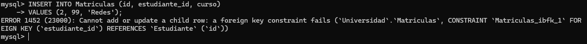

# Fundamentos, Integridad y Concurrencia

## Ejercicio 1: Reglas de Integridad

**Enunciado:**  
Dado un modelo de base de datos de una universidad, identificar violaciones posibles a la integridad referencial si se elimina un estudiante con cursos inscritos.  
¿Qué mecanismos usarías para evitarlo?

**Respuesta:**  
Si se elimina un estudiante con cursos inscritos, se violará la integridad referencial en la tabla de Matriculas, ya que habrá registros que hacen referencia a un estudiante que ya no existe.  
Por otro lado, si se elimina un curso, se violará la integridad referencial en la tabla de Matriculas, ya que habrá registros que hacen referencia a un curso que ya no existe.  
Para evitar esto, se pueden usar restricciones de clave foránea con diferentes opciones:  
- `ON DELETE CASCADE`: elimina automáticamente las matrículas asociadas al eliminar un estudiante.  
- `ON DELETE RESTRICT` o `NO ACTION`: impide eliminar un estudiante si tiene matrículas asociadas.  
- Verificación manual antes de borrar: realizar una comprobación previa para asegurarse de que no existan matrículas asociadas antes de proceder con la eliminación.

---

## Ejercicio 2: Implementación de Restricciones

**Enunciado:**  
Crear una tabla Matriculas con restricciones de clave foránea. Luego, insertar datos que violen la integridad y mostrar el error generado.

```sql
CREATE DATABASE IF NOT EXISTS Universidad;
USE Universidad;

CREATE TABLE Estudiante (
    id INT PRIMARY KEY,
    nombre VARCHAR(50)
);

CREATE TABLE Cursos (
    id INT PRIMARY KEY,
    curso VARCHAR(50)
);

CREATE TABLE Matriculas (
    id INT PRIMARY KEY,
    estudiante_id INT,
    curso VARCHAR(50),
    FOREIGN KEY (estudiante_id) REFERENCES Estudiante(id)
);

INSERT INTO Estudiante (id, nombre)
VALUES (1, 'Lu');

INSERT INTO Matriculas (id, estudiante_id, curso)
VALUES (1, 1, 'Base de Datos');

-- El estudiante_id = 99 no existe en la tabla Estudiante
INSERT INTO Matriculas (id, estudiante_id, curso)
VALUES (2, 99, 'Redes');
```
### Error en la consola: 



---

## Ejercicio 3: Concurrencia

**Enunciado:**  
Simular una situación donde dos usuarios intentan actualizar el mismo saldo de una cuenta bancaria.  
Analizar cómo afectan las condiciones de aislamiento (`READ COMMITTED` vs `SERIALIZABLE`).

**Pasos:**
1. Abrir dos transacciones simultáneas.
2. En cada una, leer el saldo de la cuenta.
3. Modificar el saldo (p. ej. sumarle un monto).
4. Confirmar (COMMIT) la transacción.
5. Observar diferencias de comportamiento con distintos niveles de aislamiento.

### READ COMMITTED

En el nivel de aislamiento `READ COMMITTED`, la segunda transacción puede leer el saldo actualizado por la primera, lo que puede llevar a inconsistencias si ambas transacciones intentan modificar el saldo al mismo tiempo.

```sql
CREATE DATABASE IF NOT EXISTS Transacciones;
USE Transacciones;

CREATE TABLE Cuentas (
    id_cuenta INT PRIMARY KEY,
    saldo DECIMAL(10, 2) NOT NULL
);

INSERT INTO Cuentas VALUES(1, 1500);

START TRANSACTION;
-- Transacción 1
SELECT saldo FROM Cuentas WHERE id_cuenta = 1 FOR UPDATE;
UPDATE Cuentas SET saldo = saldo + 100 WHERE id_cuenta = 1;
COMMIT;

-- Transacción 2
START TRANSACTION;
SELECT saldo FROM Cuentas WHERE id_cuenta = 1 FOR UPDATE;
UPDATE Cuentas SET saldo = saldo - 50 WHERE id_cuenta = 1;
COMMIT;
```

### SERIALIZABLE

En el nivel de aislamiento `SERIALIZABLE`, la segunda transacción esperará a que la primera complete su operación antes de leer el saldo, evitando así inconsistencias. Sin embargo, esto puede llevar a bloqueos y disminuir la concurrencia.

```sql
-- Transacción 1
SET TRANSACTION ISOLATION LEVEL SERIALIZABLE;
BEGIN TRANSACTION;
SELECT saldo FROM Cuentas WHERE id_cuenta = 1 FOR UPDATE;
UPDATE Cuentas SET saldo = saldo + 100 WHERE id_cuenta = 1;
COMMIT;

-- Transacción 2
SET TRANSACTION ISOLATION LEVEL SERIALIZABLE;
BEGIN TRANSACTION;
SELECT saldo FROM Cuentas WHERE id_cuenta = 1 FOR UPDATE;
UPDATE Cuentas SET saldo = saldo - 50 WHERE id_cuenta = 1;
COMMIT;
```

---

# Optimización de Consultas, Índices y Vistas

---

## Ejercicio 4: Plan de Ejecución

**Enunciado:**  
Usar una base de datos con más de 100,000 registros. Ejecutar una consulta sin índice y luego con índice. Usar `EXPLAIN` para comparar rendimiento.

```sql
CREATE DATABASE IF NOT EXISTS Inventario;
USE Inventario;


DROP TABLE IF EXISTS productos;
CREATE TABLE productos (
    id INT PRIMARY KEY,
    nombre VARCHAR(100),
    descripcion TEXT,
    precio DECIMAL(10, 2),
    stock INT,
    categoria VARCHAR(50),
    marca VARCHAR(50),
    fecha_creacion DATE
);

-- Insertar datos en la tabla con el código del archivo ecommerce_productos.sql

-- Explain para ver el plan de ejecución sin índice de la categoría Productos
EXPLAIN SELECT * FROM productos WHERE categoria = 'Electrónica';

-- Crear índice en la columna categoria
CREATE INDEX idx_categoria ON productos(categoria);

-- Ejecutar la misma consulta con el índice creado
EXPLAIN SELECT * FROM productos WHERE categoria = 'Electrónica';

-- Conclusión de ambas consultas. 
```

---

## Ejercicio 5: Creación de Índices

**Enunciado:**  
Diseñar una consulta que filtre por múltiples campos. Crear diferentes índices y medir cuál ofrece mejor rendimiento.

```sql
CREATE INDEX idx_precio ON productos(precio);
CREATE INDEX idx_categoria ON productos(categoria); -- Reutilizamos el del punto anterior

-- Consulta a analizar
EXPLAIN SELECT * FROM productos WHERE precio > '10000' AND categoria = 'Electrónica';

-- Índices de Múltiples Columnas
CREATE INDEX idx_precio_categoria ON productos(precio, categoria);

-- Consulta a analizar
EXPLAIN SELECT * FROM productos WHERE categoria = 'Electrónica' AND precio > '10000';

-- Conclusión de ambas consultas.
-- CAPTURAS DE PANTALLA DE LOS EXPLAIN Y CONCLUSIONES
```

---

## Ejercicio 6: Vistas

**Enunciado:**  
Crear una vista que resuma las ventas mensuales por producto. Luego, usarla en una consulta que devuelva los 5 productos más vendidos.

---

## Ejercicio 7: Gestión de Permisos

**Enunciado:**  
Crear un usuario analista que solo pueda hacer SELECT en ciertas tablas. Intentar insertar desde ese usuario y explicar el resultado.

---

## Ejercicio 8: Seguridad y Auditoría

**Enunciado:**  
Simular una auditoría simple con triggers que registren toda modificación en una tabla Clientes.

---

## Ejercicio 9: Backup y Restore

**Enunciado:**  
Documentar paso a paso cómo hacer un backup completo en MySQL o PostgreSQL y cómo restaurarlo.  
Simular una pérdida de datos y su posterior recuperación.