# Fundamentos, Integridad y Concurrencia

## Ejercicio 1: Reglas de Integridad

**Enunciado:**  
Dado un modelo de base de datos de una universidad, identificar violaciones posibles a la integridad referencial si se elimina un estudiante con cursos inscritos.  
¿Qué mecanismos usarías para evitarlo?

**Respuesta:**  
Si se elimina un estudiante con cursos inscritos, se violará la integridad referencial en la tabla de Matriculas, ya que habrá registros que hacen referencia a un estudiante que ya no existe.  
Por otro lado, si se elimina un curso, se violará la integridad referencial en la tabla de Matriculas, ya que habrá registros que hacen referencia a un curso que ya no existe.  
Para evitar esto, se pueden usar restricciones de clave foránea con diferentes opciones:  
- `ON DELETE CASCADE`: elimina automáticamente las matrículas asociadas al eliminar un estudiante.  
- `ON DELETE RESTRICT` o `NO ACTION`: impide eliminar un estudiante si tiene matrículas asociadas.  
- Verificación manual antes de borrar: realizar una comprobación previa para asegurarse de que no existan matrículas asociadas antes de proceder con la eliminación.

---

## Ejercicio 2: Implementación de Restricciones

**Enunciado:**  
Crear una tabla Matriculas con restricciones de clave foránea. Luego, insertar datos que violen la integridad y mostrar el error generado.

```sql
CREATE DATABASE IF NOT EXISTS Universidad;
USE Universidad;

CREATE TABLE Estudiante (
    id INT PRIMARY KEY,
    nombre VARCHAR(50)
);

CREATE TABLE Cursos (
    id INT PRIMARY KEY,
    curso VARCHAR(50)
);

CREATE TABLE Matriculas (
    id INT PRIMARY KEY,
    estudiante_id INT,
    curso VARCHAR(50),
    FOREIGN KEY (estudiante_id) REFERENCES Estudiante(id)
);

INSERT INTO Estudiante (id, nombre)
VALUES (1, 'Lu');

INSERT INTO Matriculas (id, estudiante_id, curso)
VALUES (1, 1, 'Base de Datos');

-- El estudiante_id = 99 no existe en la tabla Estudiante
INSERT INTO Matriculas (id, estudiante_id, curso)
VALUES (2, 99, 'Redes');
```
### Error en la consola: 

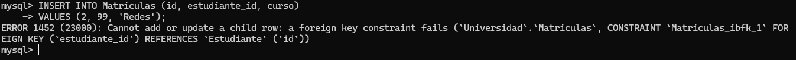

---

## Ejercicio 3: Concurrencia

**Enunciado:**  
Simular una situación donde dos usuarios intentan actualizar el mismo saldo de una cuenta bancaria.  
Analizar cómo afectan las condiciones de aislamiento (`READ COMMITTED` vs `SERIALIZABLE`).

**Pasos:**
1. Abrir dos transacciones simultáneas.
2. En cada una, leer el saldo de la cuenta.
3. Modificar el saldo (p. ej. sumarle un monto).
4. Confirmar (COMMIT) la transacción.
5. Observar diferencias de comportamiento con distintos niveles de aislamiento.

### READ COMMITTED

En el nivel de aislamiento `READ COMMITTED`, la segunda transacción puede leer el saldo actualizado por la primera, lo que puede llevar a inconsistencias si ambas transacciones intentan modificar el saldo al mismo tiempo.

```sql
CREATE DATABASE IF NOT EXISTS Transacciones;
USE Transacciones;

CREATE TABLE Cuentas (
    id_cuenta INT PRIMARY KEY,
    saldo DECIMAL(10, 2) NOT NULL
);

INSERT INTO Cuentas VALUES(1, 1500);

START TRANSACTION;
-- Transacción 1
SELECT saldo FROM Cuentas WHERE id_cuenta = 1 FOR UPDATE;
UPDATE Cuentas SET saldo = saldo + 100 WHERE id_cuenta = 1;
COMMIT;

-- Transacción 2
START TRANSACTION;
SELECT saldo FROM Cuentas WHERE id_cuenta = 1 FOR UPDATE;
UPDATE Cuentas SET saldo = saldo - 50 WHERE id_cuenta = 1;
COMMIT;
```

### SERIALIZABLE

En el nivel de aislamiento `SERIALIZABLE`, la segunda transacción esperará a que la primera complete su operación antes de leer el saldo, evitando así inconsistencias. Sin embargo, esto puede llevar a bloqueos y disminuir la concurrencia.

```sql
-- Transacción 1
SET TRANSACTION ISOLATION LEVEL SERIALIZABLE;
BEGIN TRANSACTION;
SELECT saldo FROM Cuentas WHERE id_cuenta = 1 FOR UPDATE;
UPDATE Cuentas SET saldo = saldo + 100 WHERE id_cuenta = 1;
COMMIT;

-- Transacción 2
SET TRANSACTION ISOLATION LEVEL SERIALIZABLE;
BEGIN TRANSACTION;
SELECT saldo FROM Cuentas WHERE id_cuenta = 1 FOR UPDATE;
UPDATE Cuentas SET saldo = saldo - 50 WHERE id_cuenta = 1;
COMMIT;
```

---

# Optimización de Consultas, Índices y Vistas

---

## Ejercicio 4: Plan de Ejecución

**Enunciado:**  
Usar una base de datos con más de 100,000 registros. Ejecutar una consulta sin índice y luego con índice. Usar `EXPLAIN` para comparar rendimiento.

```sql
CREATE DATABASE IF NOT EXISTS Inventario;
USE Inventario;


DROP TABLE IF EXISTS productos;
CREATE TABLE productos (
    id INT PRIMARY KEY,
    nombre VARCHAR(100),
    descripcion TEXT,
    precio DECIMAL(10, 2),
    stock INT,
    categoria VARCHAR(50),
    marca VARCHAR(50),
    fecha_creacion DATE
);

-- Insertar datos en la tabla con el código del archivo ecommerce_productos.sql

-- Explain para ver el plan de ejecución sin índice de la categoría Productos
EXPLAIN SELECT * FROM productos WHERE categoria = 'Electrónica';

-- Crear índice en la columna categoria
CREATE INDEX idx_categoria ON productos(categoria);

-- Ejecutar la misma consulta con el índice creado
EXPLAIN SELECT * FROM productos WHERE categoria = 'Electrónica';
```

**Captura con el detalle del explain y la confirmación del uso del index para la búsqueda** 

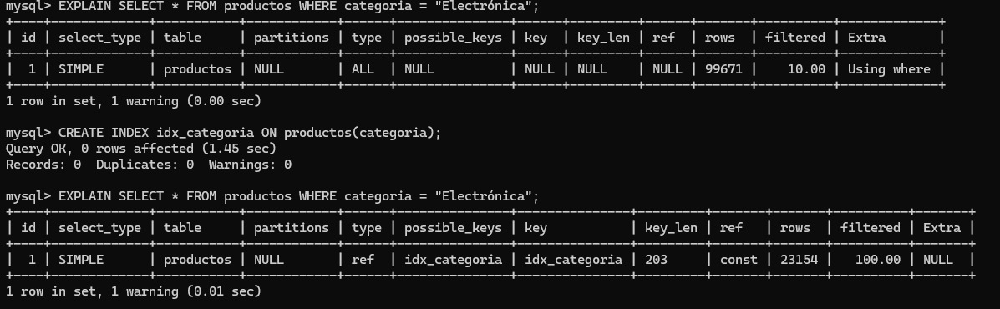

**Conclusión de ambas consultas:**

En primer lugar, la columna type de la primera consulta indica que se trata de un `ALL` (full table scan), es decir una revisión completa de la tabla. En cambio, en la segúnda consulta, ese parámetro pasa a ser `ref`, es decir, una búsqueda por índice. Por otro lado, la columna `posible_keys` y `key` marca el uso de `idx_categoría`, diferente al contenido NULL de la primera consulta. 
Finalmente, en la columna row se puede observar la estimación de filas leídas, donde vemos un marcado descenso en la segunda consulta, pasando de 99.671 filas a 23.154 filas.

---

## Ejercicio 5: Creación de Índices

**Enunciado:**  
Diseñar una consulta que filtre por múltiples campos. Crear diferentes índices y medir cuál ofrece mejor rendimiento.

### Índices Simples

```sql
CREATE INDEX idx_precio ON productos(precio);
CREATE INDEX idx_categoria ON productos(categoria); -- Reutilizamos el del punto anterior
```

**Consulta a analizar:**

```sql
EXPLAIN SELECT * FROM productos WHERE precio > '10000' AND categoria = 'Electrónica';
```

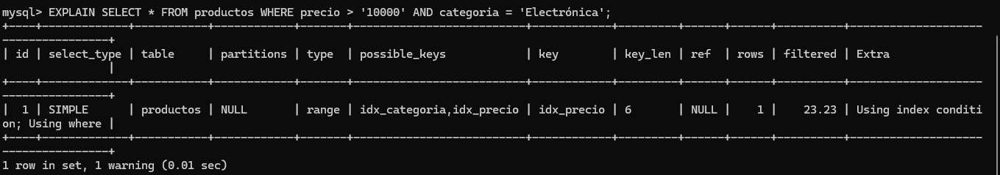

---

### Índices de Múltiples Columnas

```sql
CREATE INDEX idx_precio_categoria ON productos(precio, categoria);
```

**Consulta a analizar:**

```sql
EXPLAIN SELECT * FROM productos WHERE categoria = 'Electrónica' AND precio > '10000';
```

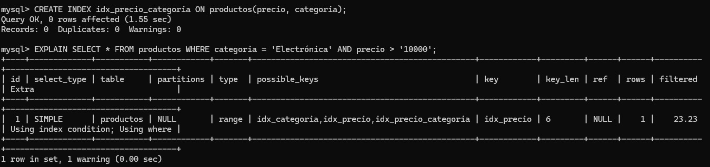

---

### Conclusión de ambas consultas

En la primera consulta, al usar índices simples, el motor de base de datos puede combinar los índices `idx_precio` y `idx_categoria` para optimizar la búsqueda. Sin embargo, esto puede no ser tan eficiente como un índice compuesto.

En la segunda consulta, el índice compuesto `idx_precio_categoria` permite al motor de base de datos realizar una búsqueda más eficiente, ya que está diseñado específicamente para filtrar por ambas columnas en conjunto. Esto reduce significativamente el número de filas examinadas y mejora el rendimiento de la consulta.

## Ejercicio 6: Vistas

**Enunciado:**  
Crear una vista que resuma las ventas mensuales por producto. Luego, usarla en una consulta que devuelva los 5 productos más vendidos.

```sql
-- Usando el archivo original ecommerce_productos.sql normalizamos la tabla con el archivo ecommerce_normalizado.sql
-- Luego creamos la tabla ventas con el archivo ecommerce_tabla_ventas

CREATE VIEW VentasMensuales AS
SELECT producto_id, MONTH(fecha) AS mes, SUM(cantidad) AS total_vendido
FROM Ventas
GROUP BY producto_id, MONTH(fecha);
```

**Consulta sobre la vista:**
```sql
SELECT producto_id, SUM(total_vendido) AS total_producto_mas_vendido
FROM VentasMensuales
GROUP BY producto_id
ORDER BY total_producto_mas_vendido DESC
LIMIT 5;
```

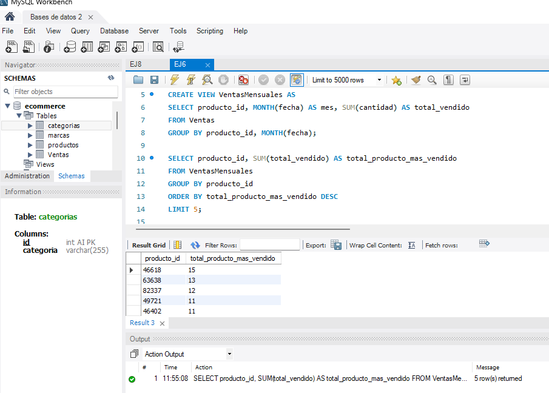

---

## Ejercicio 7: Gestión de Permisos

**Enunciado:**  
Crear un usuario `analista` que solo pueda realizar consultas (`SELECT`) en ciertas tablas. Intentar insertar datos desde ese usuario y explicar el resultado.

### Creación del Usuario y Asignación de Permisos

```sql
CREATE USER 'analista'@'localhost' IDENTIFIED BY 'clave_segura';
GRANT SELECT ON ecommerce.Ventas TO 'analista'@'localhost';
FLUSH PRIVILEGES;
```
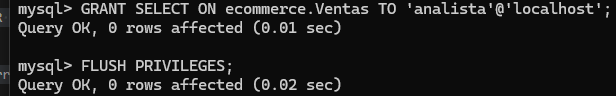

### Cambio de User en mysql e Intento de Inserción de Datos en Tabla

```sql
INSERT INTO ecommerce.Ventas (producto_id, cantidad, fecha) VALUES (86394, 5, '2023-10-01');
```
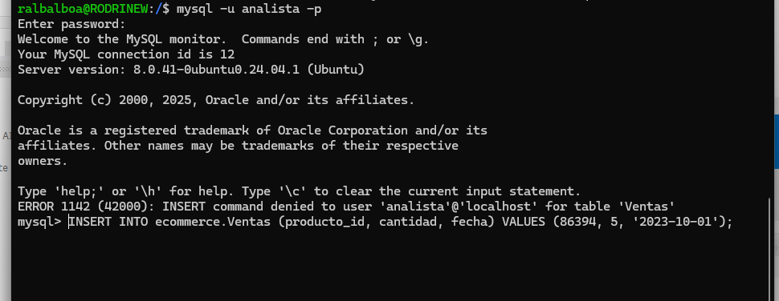

### Resultado del Error

```
ERROR 1142 (42000): INSERT command denied to user 'analista'@'localhost' for table 'Ventas'
```

El error indica que el usuario `analista` no tiene los permisos necesarios para ejecutar un comando `INSERT` en la tabla `Ventas`.

### Explicación del Error

- **Código de Error 1142 (42000):** Este código específico de MySQL señala un problema de permisos ya que el usuario `analista` solo tiene permisos para realizar consultas (`SELECT`) en la tabla `Ventas`, pero no puede realizar operaciones de escritura como `INSERT`.

### Posible solución

Si se requiere que el usuario `analista` pueda realizar operaciones adicionales, un administrador de la base de datos con privilegios suficientes deberá otorgar los permisos necesarios. Por ejemplo:

```sql
GRANT INSERT ON ecommerce.Ventas TO 'analista'@'localhost';
FLUSH PRIVILEGES;
```

## Ejercicio 8: Seguridad y Auditoría

**Enunciado:**  
Simular una auditoría simple con triggers que registren toda modificación en una tabla Clientes.

### Creación de una tabla y su correspondiente tabla de auditoría

```sql
CREATE TABLE clientes (
    id INT AUTO_INCREMENT PRIMARY KEY,
    nombre VARCHAR(100),
    email VARCHAR(100)
);

CREATE TABLE auditoria_clientes (
    id INT AUTO_INCREMENT PRIMARY KEY,
    accion VARCHAR(10),
    cliente_id INT,
    datos_viejos JSON,
    datos_nuevos JSON,
    fecha DATETIME DEFAULT CURRENT_TIMESTAMP
);
```
### Creación del trigger para registrar las modificaciones en la tabla

```sql
DELIMITER $$

CREATE TRIGGER t_auditoria_clientes
AFTER UPDATE ON clientes
FOR EACH ROW
BEGIN
    INSERT INTO auditoria_clientes (
        accion,
        cliente_id,
        datos_viejos,
        datos_nuevos
    ) VALUES (
        'UPDATE',
        OLD.id,
        JSON_OBJECT('nombre', OLD.nombre, 'email', OLD.email),
        JSON_OBJECT('nombre', NEW.nombre, 'email', NEW.email)
    );
END$$

DELIMITER ;
```

### Inserción de datos en la tabla y su respectiva consulta para verificado de los mismos:

```sql
INSERT INTO clientes (nombre, email) VALUES ('Marty McFly', 'delorean@outatime.com'),('Emmet Brown', 'condensador@deflujos.com');

SELECT * FROM clientes;
```
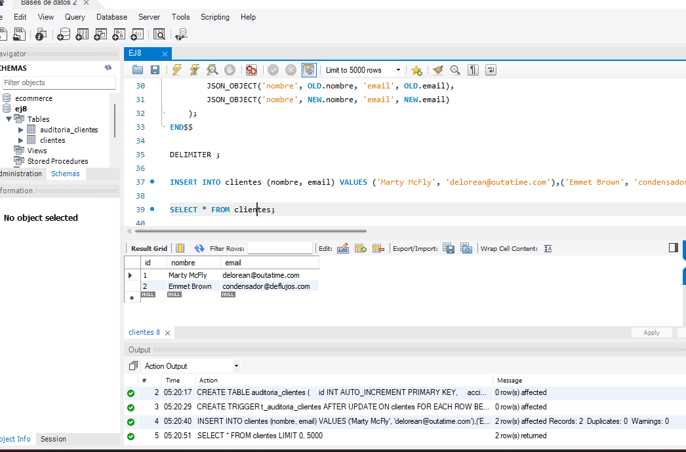

### Actualización de datos en la tabla y su respectiva consulta:

```sql
UPDATE clientes SET nombre = 'Biff Tannen' WHERE id = 1;

SELECT * FROM clientes;
```
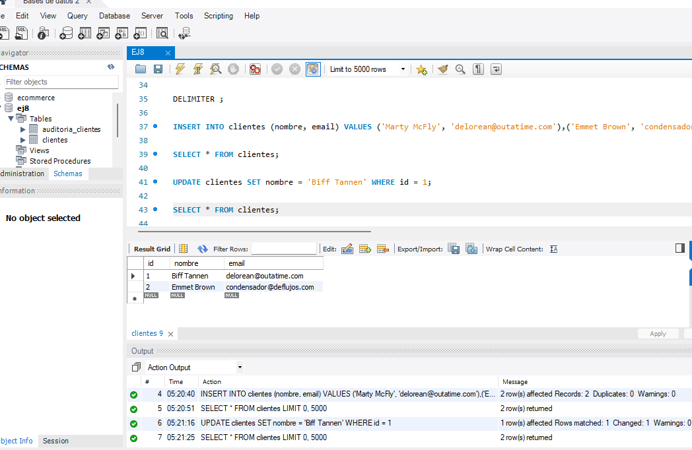

### Consulta de la tabla de auditoría para ver si los triggers funcionaron y se registraron los datos antiguos y los actualizados:

```sql
SELECT * FROM auditoria_clientes;
```
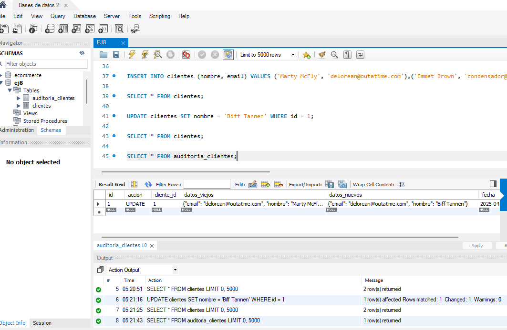

## Ejercicio 9: Backup y Restore

**Enunciado:**  
Documentar paso a paso cómo hacer un backup completo en MySQL o PostgreSQL y cómo restaurarlo.  
Simular una pérdida de datos y su posterior recuperación.

#### **MySQL - BACKUP:**
Primero se hizo un backup de las tablas en la base de datos ecommerce directamente en consola:

```bash
sudo mysqldump -u root ecommerce > ecommerce-2025-04-22_05-32-57.sql
```

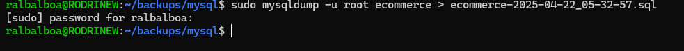

#### **Backup automático con Cron por medio de Script en Bash:**
Se creó un script en bash para poder ejecutar el backup como comando a través de **Cron**.

```bash
#!/bin/bash

# Configuraciones
USER="usuario"
PASSWORD="clave"
DATABASE="basededatos"
BACKUP_DIR="/home/usuario/backups/mysql"
DATE=$(date +%F_%H-%M-%S)
FILENAME="$DATABASE-$DATE.sql"

# Crear directorio si no existe
mkdir -p "$BACKUP_DIR"

# Comando de mysql
mysqldump -u $USER -p$PASSWORD $DATABASE > "$BACKUP_DIR/$FILENAME"
```
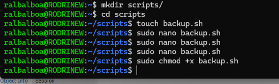

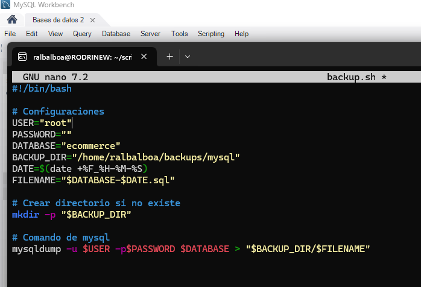

Se hizo también una consulta de la tabla previa al backup automático:
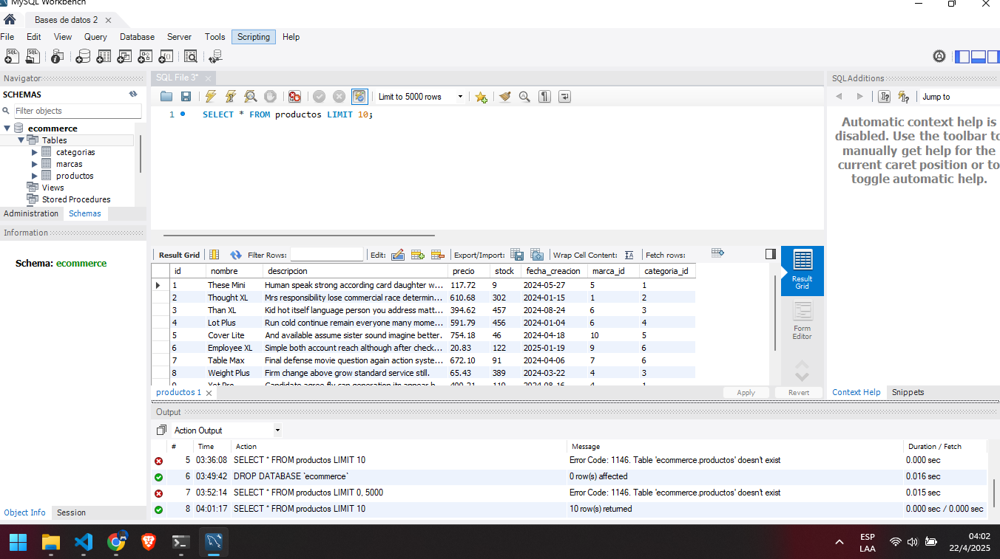 

#### **Activación del Cron:**
Ahora se procede a configurar la activación del Cron mediante crontab para que se realice el respaldo automático de las tablas. Se configuró solo unos minutos adelantado y luego del tiempo fijado para el respaldo automático se precedió a verificar si efectivamente se hizo el mismo.
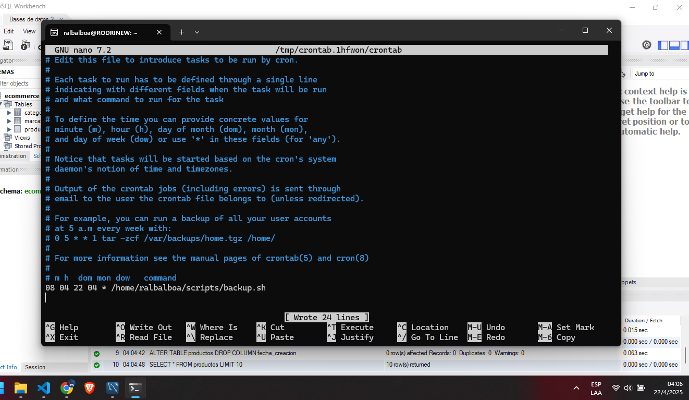

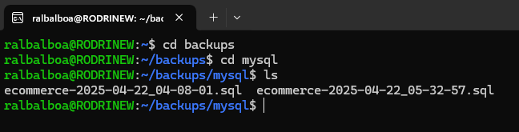

#### **Simular pérdida y recuperación:**
Se realiza una nueva consulta de tabla pero simulando un drop (pérdida) de la columna `fecha_creacion`

```sql
ALTER TABLE productos DROP COLUMN fecha_creacion;
```

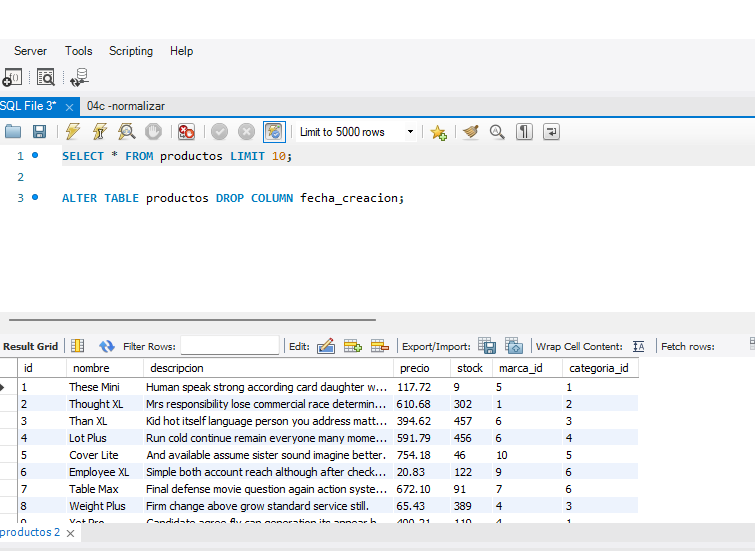


#### **MySQL - RESTORE:**
Ahora se procede a la recuperación de la tabla utilizando el backup hecho por Cron.

```bash
mysql -u root ecommerce < ecommerce-2025-04-22_04-08-01.sql
```

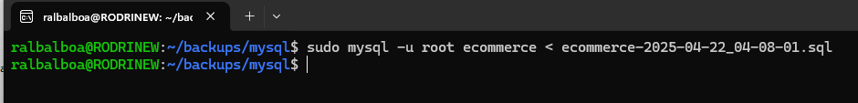

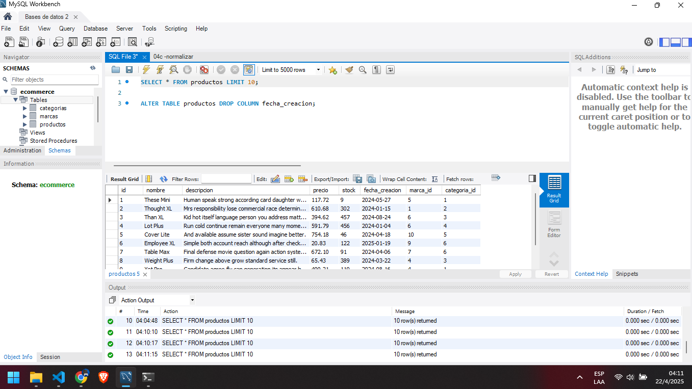


---